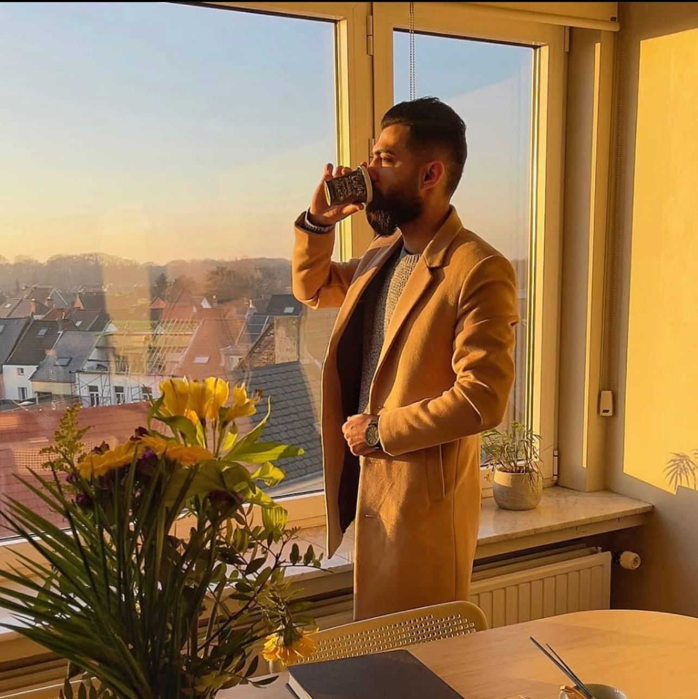

# Mohammed Abrash

---

## About Me

I am a _Graphic Designer_ and a beginner in _Front-End Development_. I
specialize in creating visually appealing designs and aim to combine my design
expertise with web development to build interactive and user-friendly websites.
This is my first project, and I am excited to learn and grow in the field.

---

## Languages

- _English_
- _Dutch_
- _Arabic_
- _Turkish_

---

## Skills

### Graphic Design

- Proficient in:
  - _Adobe Photoshop_
  - _CorelDRAW_

### Front-End Development

- Learning the basics of:
  - _HTML, CSS, JavaScript_
- Improving skills in:
  - _Responsive Design_
  - _Git & GitHub_

---

## Projects

- _This is my first project using Markdown._
- Upcoming: Combining graphic design with front-end development to create
  engaging websites.

---

## Hobbies

- _Photography_ 📷
- _Travel_ ✈
- _Sports_ 🏋‍♂

---

## Contact

- _Email:_ abrashmohammed151@gmail.com
- _GitHub:_ [github.com/Mohammed-ABR](https://github.com/Mohammed-ABR)
