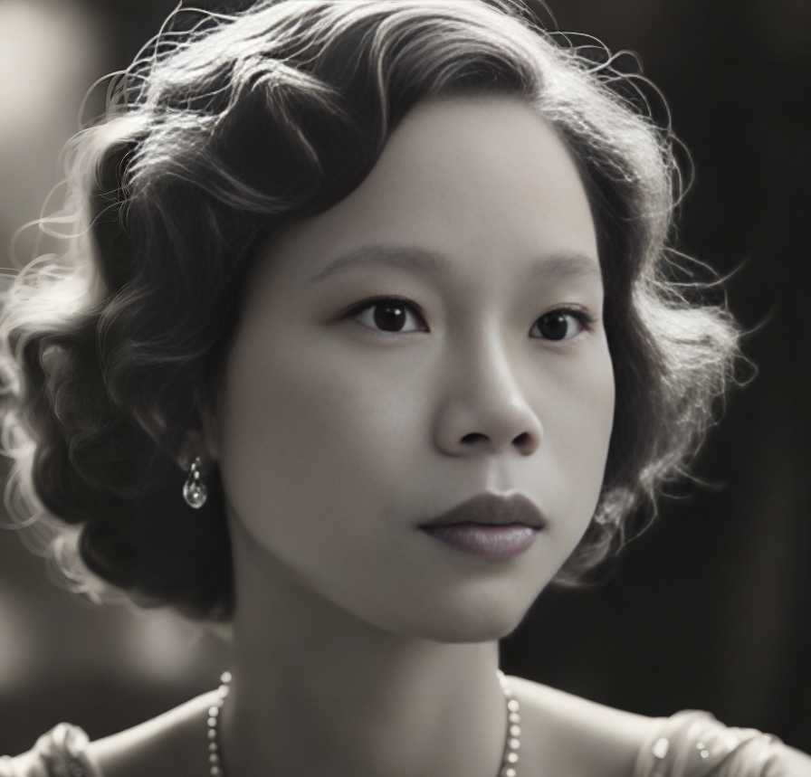

# Catherine Lin's Bio

## Summary

---

**Dynamic and tech-savy professional with over 8 years of experience in
marketing, project management and cross-functional collaboration, now pursuing a
career as a web developer.**

1. My Speaking Languages : [Languages](#languages-️)
2. Programming Lanaguages Learned :
   [Programming-languages](#programming-languages-)
3. Education Background : [Education](#education-)
4. Work Experience : [Word-Experience](#work-experience-)
5. My Hobby : [Hobby](#hobby-️)

---

### Languages 🗣️

- Mandarin Chinese : Native
- English : Fluent
- French : Proficient
- Dutch : Basics

---

### Programming Languages 💻

- HTML
- CSS
- Javascript
- React

---

### Education 🎓

- M.Ed Disvision of Network instruction. Department Technology 2011 - 2013
  _National Taiwan Normal University_

- B.A. in Mass Communication 2003 - 2007 _Chinese Culture University_

---

### Work Experience 💼

- 2023 - Present **Co-Founder at YUM SUM SRL**
- 2017 - 2023 **Marketing Manager at YUM SUM SRL**
- 2013 - 1016 **Supervisor of Strategy Administration Departement at OME
  Technology**

---

### Hobby 🏊🏼‍♂️

- Swimming
- Reading
- Traveling
- Learning New Things
